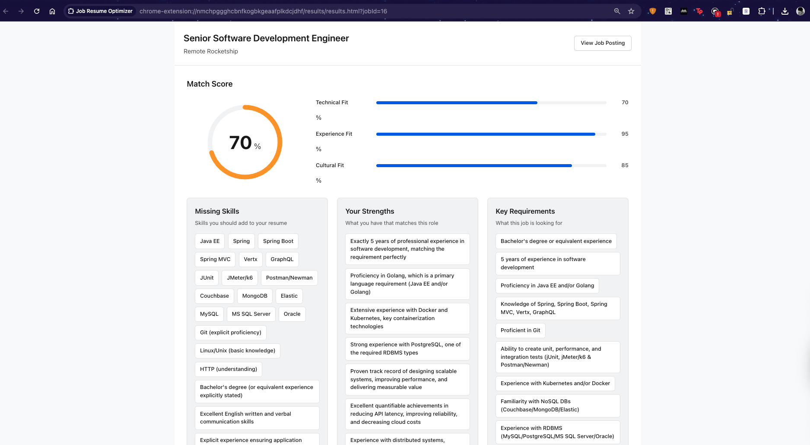
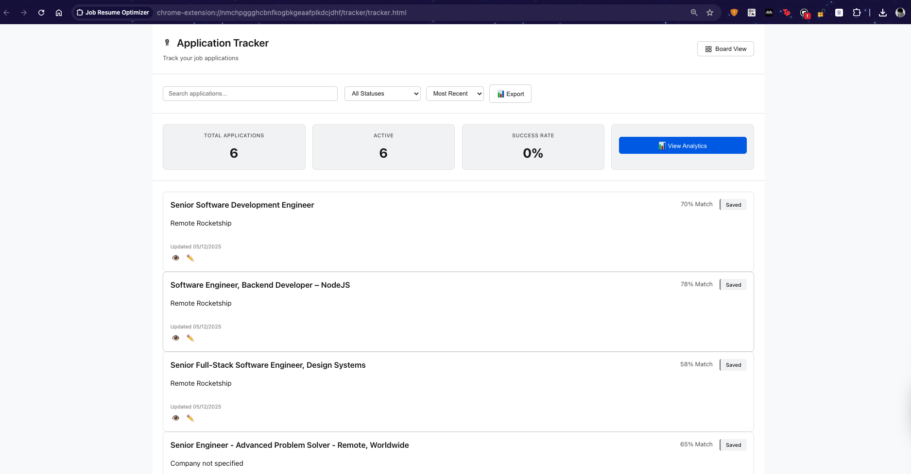
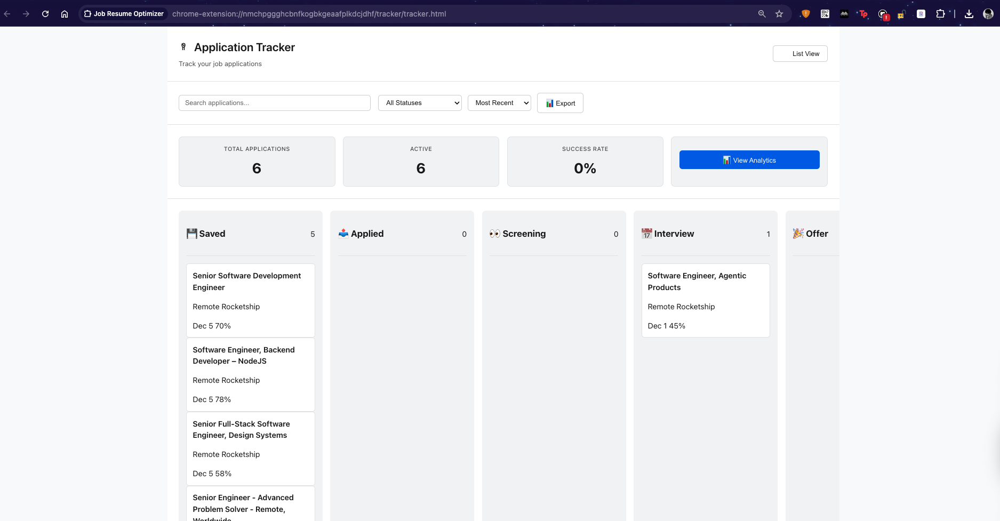
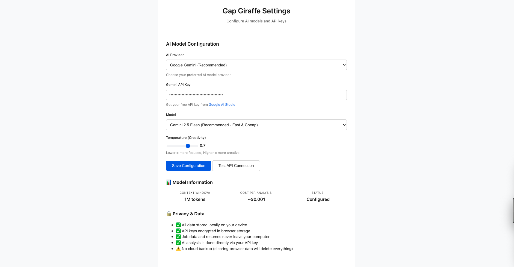
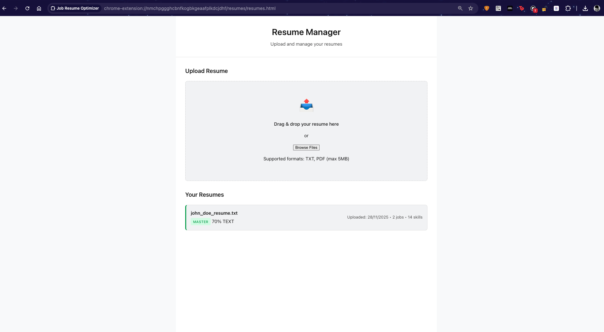

# Gap Giraffe 🦒

**Your AI-powered job application assistant**

Gap Giraffe helps you land more interviews by analyzing job postings, matching them with your resume, and tracking your applications—all in one place.

---

## 📸 Screenshots

### Job Analysis Results

*See your match score and get actionable suggestions to improve your resume*

### Application Tracker - List View

*Track all your applications in one place with clean list view*

### Application Tracker - Board View

*Organize applications in Kanban-style board view*

### Settings Page

*Configure your AI model and API keys*

### Resume Manager

*Upload and manage multiple resume versions*

### Live example view

*See how Gap Giraffe works in real-time*

---

## What Does It Do?

Gap Giraffe is a Chrome extension that:

1. **Analyzes Job Postings** - Automatically extracts requirements from any job listing
2. **Matches Your Resume** - Compares the job with your resume and gives you a match score
3. **Provides Suggestions** - Shows you exactly what to add or emphasize in your resume
4. **Tracks Applications** - Manages all your job applications in one dashboard
5. **Exports Data** - Download your applications as a spreadsheet

---

## How to Install

### Step 1: Get the Code
```bash
git clone git@github.com:d4rthvadr/gap-giraffe.git
cd gap-giraffe
```

### Step 2: Install & Build
```bash
npm install
npm run build
```

### Step 3: Add to Chrome
1. Open Chrome and go to `chrome://extensions/`
2. Turn on **Developer mode** (toggle in top-right)
3. Click **Load unpacked**
4. Select the `extension` folder from this project

### Step 4: Set Up Your API Key
1. Get a free API key from [Google AI Studio](https://aistudio.google.com/app/apikey)
2. Click the Gap Giraffe icon in Chrome
3. Go to **Settings**
4. Paste your API key and click **Save**

---

## How to Use

### Analyzing a Job
1. Open any job posting (LinkedIn, Indeed, company website, etc.)
2. Click the **Gap Giraffe** extension icon
3. Click **Analyze This Job**
4. View your match score and suggestions

### Tracking Applications
1. After analyzing a job, click **Save to Applications**
2. Click **Job Tracker** to see all your applications
3. Update status as you progress (Applied → Interview → Offer)
4. Use filters and search to find specific applications

### Viewing Analytics
1. Open the **Job Tracker**
2. Click **View Analytics**
3. See your application funnel, success rate, and time metrics

### Exporting Data
1. In the **Job Tracker**, click **Export**
2. Your applications download as a CSV file
3. Open in Excel, Google Sheets, or any spreadsheet app

---

## Features

### 📊 Smart Job Analysis
- Extracts job requirements automatically
- Identifies key skills and experience needed
- Calculates match score (0-100%)
- Shows what you're missing vs. what you have

### 📝 Resume Matching
- Upload your resume (PDF, TXT, or DOCX)
- Compares your skills with job requirements
- Highlights gaps and strengths
- Provides actionable suggestions

### 📋 Application Tracking
- Save interesting jobs with one click
- Track status: Saved, Applied, Interview, Offer, etc.
- Add notes and dates
- View in List or Board (Kanban) layout
- Search and filter by company, status, or date

### 📈 Analytics Dashboard
- Application funnel (how many move to each stage)
- Average time to interview and offer
- Success rate tracking
- Status breakdown charts

### 💾 Data Export
- Export all applications to CSV
- Includes job title, company, status, dates, notes
- Works with Excel and Google Sheets

### 🔒 Privacy First
- All data stored locally in your browser
- No data sent to external servers (except AI analysis)
- You control your API key
- Delete data anytime

---

## Technology Stack

### What We Use
- **TypeScript** - For type-safe code
- **Chrome Extension API** - To integrate with your browser
- **IndexedDB** - Local database in your browser
- **Google Gemini AI** - For intelligent job analysis
- **esbuild** - Fast build tool

### Why These Choices?
- **No frameworks** - Keeps the extension fast and lightweight
- **Local storage** - Your data stays private
- **Modern CSS** - Clean, professional design
- **Minimal dependencies** - Quick to install and run

---

## Project Structure

```
gap-giraffe/
├── extension/          # The Chrome extension
│   ├── popup/         # Main popup window
│   ├── tracker/       # Application tracker page
│   ├── results/       # Analysis results page
│   ├── options/       # Settings page
│   └── styles/        # Shared design system
├── src/               # Source code (TypeScript)
│   ├── ai/           # AI integration
│   ├── db/           # Database layer
│   ├── resume/       # Resume parsing
│   └── tracker/      # Application tracking
└── docs/             # Documentation
```

---

## Development

### Build Commands
```bash
# Build once
npm run build

# Auto-rebuild on changes
npm run watch

# Clean build files
npm run clean
```

### Making Changes
1. Edit files in `src/` or `extension/`
2. Run `npm run build`
3. Reload the extension in Chrome

---

## FAQ

**Q: Is it free?**  
A: Yes! You just need a free Google AI API key. Each analysis costs ~$0.0002 (fractions of a penny).

**Q: Where is my data stored?**  
A: Everything is stored locally in your browser using IndexedDB. Nothing is sent to external servers except the job description to Google AI for analysis.

**Q: Can I use it offline?**  
A: You can view your saved applications offline, but analyzing new jobs requires an internet connection for the AI.

**Q: What job sites does it work with?**  
A: Any website! It works on LinkedIn, Indeed, company career pages, and more.

**Q: Can I delete my data?**  
A: Yes, you can clear all data from Chrome's extension settings.

---

## Support

Found a bug or have a suggestion? [Open an issue](https://github.com/d4rthvadr/gap-giraffe/issues)

---

## License

MIT License - feel free to use and modify!

---

**Version:** 1.0.0  
**Last Updated:** December 5, 2025
